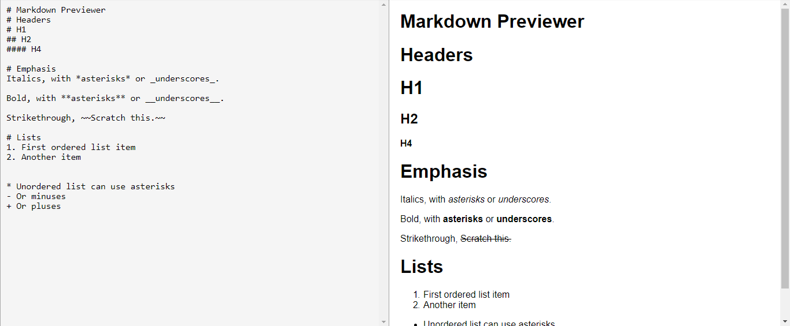
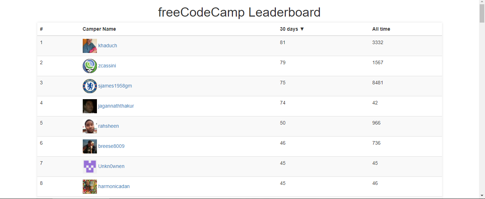

# Free Code Camp
### Intermediate Front End Development Projects

* Random Quote Machine - [Código](random-quote-machine) - [Demo](https://codepen.io/alexcarvalho/full/bYvoOO/)
  - HTML
  - CSS/SCSS
  - Font Awesome
  - JavaScript
  - jQuery
  - Responsive 
  

* Local Weather - [Código](local-weather) - [Demo](https://codepen.io/alexcarvalho/full/WXJjzK/)
  - HTML
  - CSS/SCSS
  - JavaScript
  - Vue.js
  - axios.js
  - Responsive  
  
  
* Wikipedia Viewer - [Código](wikipedia-viewer) - [Demo](https://codepen.io/alexcarvalho/full/XzvbWV/)
  - HTML
  - CSS/SCSS
  - Font Awesome
  - JavaScript
  - Vue.js
  - axios.js
  - Responsive
  
  
* Twitch.tv JSON API  - [Código](twitchtv-json-api) - [Demo](https://codepen.io/alexcarvalho/full/VrJjbb/)
  - HTML
  - CSS/SCSS
  - Bootstrap
  - JavaScript
  - Vue.js
  - axios.js
  - Responsive  
  
  
    
### React Projects

* Markdown Previewer  - [Código](markdown-previewer) - [Demo](https://codepen.io/alexcarvalho/full/ZvEREQ/)
  - HTML
  - CSS/SCSS
  - JavaScript
  - Babel
  - React
  - marked.js
  - Responsive 
  
  
* Camper Leaderboard  - [Código](camper-leaderboard) - [Demo](https://codepen.io/alexcarvalho/full/qpXZOE/)
  - HTML
  - CSS/SCSS
  - Bootstrap
  - JavaScript
  - Babel
  - React
  - axios.js
  - Responsive 
  
  
  